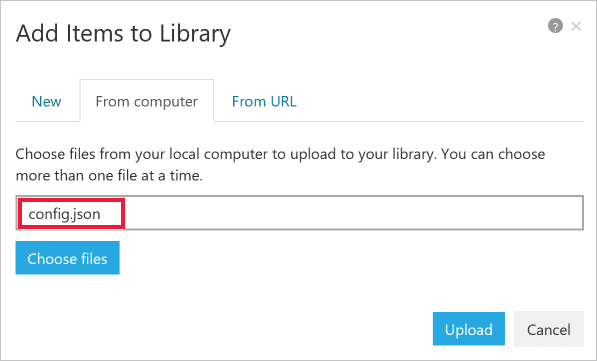

# Azure Machine Learning service sample notebooks

To run the notebooks in this repository use one of these methods:

## Use Azure Notebooks - Jupyter based notebooks in the Azure cloud

1. 
[Import sample notebooks ](https://aka.ms/aml-clone-azure-notebooks) into Azure Notebooks if they are not already there.
1.  Create a workspace and its configuration file (**config.json**) using [these instructions](https://aka.ms/aml-how-to-configure-environment).
1. Select `+New` in the Azure Notebook toolbar to add your **config.json** file to the imported folder.
    
1. Open the notebook.
    
    **Make sure the Azure Notebook kernal is set to `Python 3.6`** when you open a notebook. 
    
    

## **Use your own notebook server**

1. Use [these instructions](https://aka.ms/aml-how-to-configure-environment) to:
    * Create a workspace and its configuration file (**config.json**).
    * Configure your notebook server.
1. Clone [this repository](https://aka.ms/aml-notebooks).
1. Add your **config.json** file to the cloned folder
1. You may need to install other packages for specific notebooks
1. Start your notebook server.
1. Open the notebook you want to run.

> Note: **Looking for automated machine learning samples?**
> For your convenience, you can use an installation script instead of the steps below for the automated ML notebooks. Go to the [automl folder README](automl/README.md) and follow the instructions.  The script installs all  packages needed for notebooks in that folder.

# Contributing

This project welcomes contributions and suggestions.  Most contributions require you to agree to a
Contributor License Agreement (CLA) declaring that you have the right to, and actually do, grant us
the rights to use your contribution. For details, visit https://cla.microsoft.com.

When you submit a pull request, a CLA-bot will automatically determine whether you need to provide
a CLA and decorate the PR appropriately (e.g., label, comment). Simply follow the instructions
provided by the bot. You will only need to do this once across all repos using our CLA.

This project has adopted the [Microsoft Open Source Code of Conduct](https://opensource.microsoft.com/codeofconduct/).
For more information see the [Code of Conduct FAQ](https://opensource.microsoft.com/codeofconduct/faq/) or
contact [opencode@microsoft.com](mailto:opencode@microsoft.com) with any additional questions or comments.
