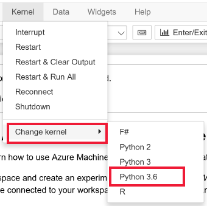

For full documentation for Azure Machine Learning service, visit **https://aka.ms/aml-docs**.
# Sample Notebooks for Azure Machine Learning service

To run the notebooks in this repository use one of these methods:

## Use Azure Notebooks - Jupyter based notebooks in the Azure cloud

1. [](https://aka.ms/aml-clone-azure-notebooks)
[Import sample notebooks ](https://aka.ms/aml-clone-azure-notebooks) into Azure Notebooks.
1. Follow the instructions in the [00.configuration](00.configuration.ipynb) notebook to create and connect to a workspace.
1. Open one of the sample notebooks.
    
    **Make sure the Azure Notebook kernel is set to `Python 3.6`** when you open a notebook.  
    
    


## **Use your own notebook server**

Video walkthrough:

[](https://youtu.be/VIsXeTuW3FU)

1. Setup a Jupyter Notebook server and [install the Azure Machine Learning SDK](https://docs.microsoft.com/en-us/azure/machine-learning/service/quickstart-create-workspace-with-python).
1. Clone [this repository](https://aka.ms/aml-notebooks).
1. You may need to install other packages for specific notebook. 
    - For example, to run the Azure Machine Learning Data Prep notebooks, install the extra dataprep SDK:
    ```
     pip install --upgrade azureml-dataprep
    ```

1. Start your notebook server.
1. Follow the instructions in the [00.configuration](00.configuration.ipynb) notebook to create and connect to a workspace.
1. Open one of the sample notebooks.


> Note: **Looking for automated machine learning samples?**
> For your convenience, you can use an installation script instead of the steps below for the automated ML notebooks. Go to the [automl folder README](automl/README.md) and follow the instructions.  The script installs all  packages needed for notebooks in that folder.

# Contributing

This project welcomes contributions and suggestions.  Most contributions require you to agree to a
Contributor License Agreement (CLA) declaring that you have the right to, and actually do, grant us
the rights to use your contribution. For details, visit https://cla.microsoft.com.

When you submit a pull request, a CLA-bot will automatically determine whether you need to provide
a CLA and decorate the PR appropriately (e.g., label, comment). Simply follow the instructions
provided by the bot. You will only need to do this once across all repos using our CLA.

This project has adopted the [Microsoft Open Source Code of Conduct](https://opensource.microsoft.com/codeofconduct/).
For more information see the [Code of Conduct FAQ](https://opensource.microsoft.com/codeofconduct/faq/) or
contact [opencode@microsoft.com](mailto:opencode@microsoft.com) with any additional questions or comments.
