## How to use the RAPIDS on AzureML materials
### Setting up requirements
The material requires the use of the Azure ML SDK and of the Jupyter Notebook Server to run the interactive execution. Please refer to instructions to [setup the environment.](https://docs.microsoft.com/en-us/azure/machine-learning/service/how-to-configure-environment#local "Local Computer Set Up") Follow the instructions under **Local Computer**, make sure to run the last step: pip install \<new package\> with new package = progressbar2  (pip install progressbar2)
  
After following the directions, the user should end up setting a conda environment (myenv)that can be activated in an Anaconda prompt

The user would also require an Azure Subscription with a Machine Learning Services quota on the desired region for 24 nodes or more (to be able to select a vmSize with 4 GPUs as it is used on the Notebook) on the desired VM family ([NC\_v3](https://docs.microsoft.com/en-us/azure/virtual-machines/windows/sizes-gpu#ncv3-series),  [NC\_v2](https://docs.microsoft.com/en-us/azure/virtual-machines/windows/sizes-gpu#ncv2-series), [ND](https://docs.microsoft.com/en-us/azure/virtual-machines/windows/sizes-gpu#nd-series) or [ND_v2](https://docs.microsoft.com/en-us/azure/virtual-machines/windows/sizes-gpu#ndv2-series-preview)), the specific vmSize to be used within the chosen family would also need to be whitelisted for Machine Learning Services usage.  

&nbsp;  
### Getting and running the material 
Clone the AzureML Notebooks repository in GitHub by running the following command on a local_directory: 

* C:\local_directory>git clone https://github.com/Azure/MachineLearningNotebooks.git

On a conda prompt navigate to the local directory, activate the conda environment (myenv), where the Azure ML SDK was installed and launch Jupyter Notebook. 

* (myenv) C:\local_directory>jupyter notebook

From the resulting browser at http://localhost:8888/tree, navigate to the master notebook: 

* http://localhost:8888/tree/MachineLearningNotebooks/contrib/RAPIDS/azure-ml-with-nvidia-rapids.ipynb

&nbsp;  
The following notebook will appear:  

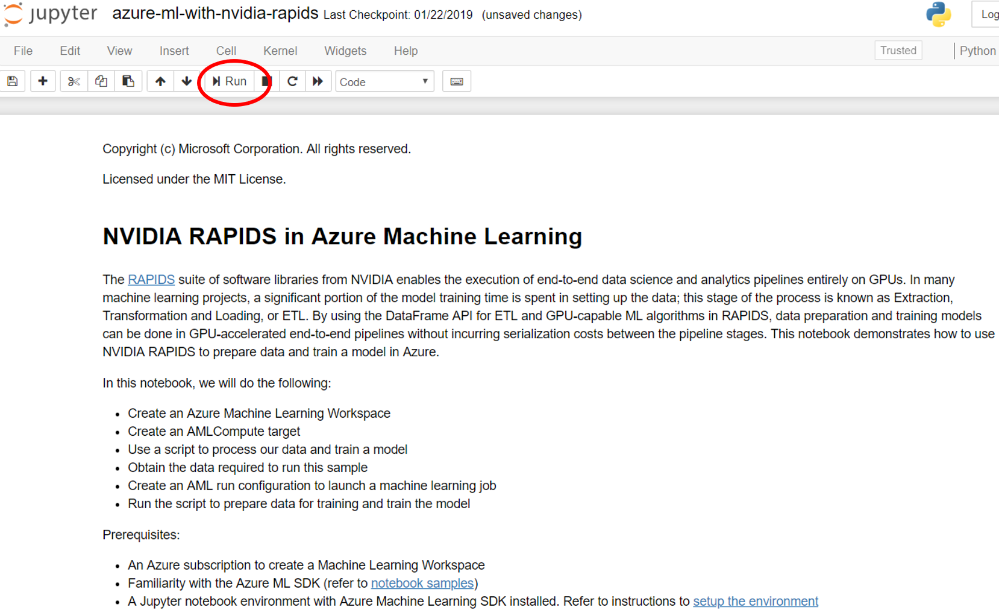

&nbsp;  
### Master Jupyter Notebook
The notebook can be executed interactively step by step, by pressing the Run button (In a red circle in the above image.)

The first couple of functional steps import the necessary AzureML libraries.  If you experience any errors please refer back to the [setup the environment.](https://docs.microsoft.com/en-us/azure/machine-learning/service/how-to-configure-environment#local "Local Computer Set Up") instructions.

&nbsp;  
#### Setting up a Workspace
The following step gathers the information necessary to set up a workspace to execute the RAPIDS script. This needs to be done only once, or not at all if you already have a workspace you can use set up on the Azure Portal:

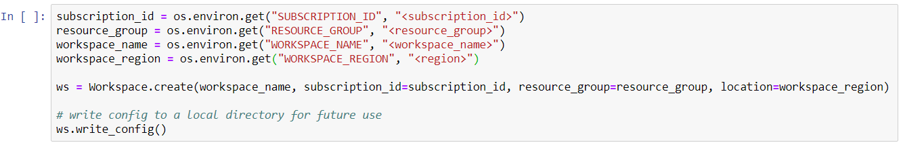

It is important to be sure to set the correct values for the subscription\_id, resource\_group, workspace\_name, and region before executing the step. An example is:

    subscription_id = os.environ.get("SUBSCRIPTION_ID", "1358e503-xxxx-4043-xxxx-65b83xxxx32d")
    resource_group = os.environ.get("RESOURCE_GROUP", "AML-Rapids-Testing")
    workspace_name = os.environ.get("WORKSPACE_NAME", "AML_Rapids_Tester")
    workspace_region = os.environ.get("WORKSPACE_REGION", "West US 2")

&nbsp;  
The resource\_group and workspace_name could take any value, the region should match the region for which the subscription has the required Machine Learning Services node quota.

The first time the code is executed it will redirect to the Azure Portal to validate subscription credentials. After the workspace is created, its related information is stored on a local file so that this step can be subsequently skipped. The immediate step will just load the saved workspace

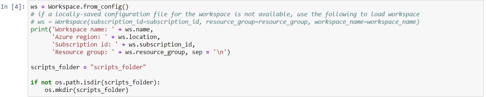

Once a workspace has been created the user could skip its creation and just jump to this step. The configuration file resides in:

* C:\local_directory\\MachineLearningNotebooks\contrib\RAPIDS\aml_config\config.json

&nbsp;  
#### Creating an AML Compute Target 
Following step, creates an AML Compute Target 

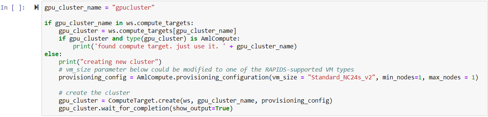

Parameter vm\_size on function call AmlCompute.provisioning\_configuration() has to be a member of the VM families ([NC\_v3](https://docs.microsoft.com/en-us/azure/virtual-machines/windows/sizes-gpu#ncv3-series),  [NC\_v2](https://docs.microsoft.com/en-us/azure/virtual-machines/windows/sizes-gpu#ncv2-series), [ND](https://docs.microsoft.com/en-us/azure/virtual-machines/windows/sizes-gpu#nd-series) or [ND_v2](https://docs.microsoft.com/en-us/azure/virtual-machines/windows/sizes-gpu#ndv2-series-preview)) that are the ones provided with P40 or V100 GPUs, that are the ones supported by RAPIDS. In this particular case an Standard\_NC24s\_V2 was used.

&nbsp;  
If the output of running the step has an error of the form:

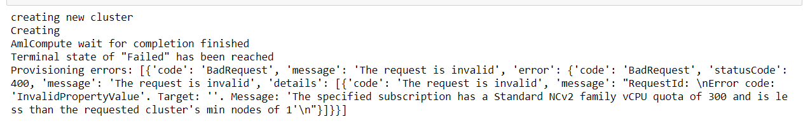

It is an indication that even though the subscription has a node quota for VMs for that family, it does not have a node quota for Machine Learning Services for that family. 
You will need to request an increase node quota for that family in that region for **Machine Learning Services**.

&nbsp;  
Another possible error is the following: 

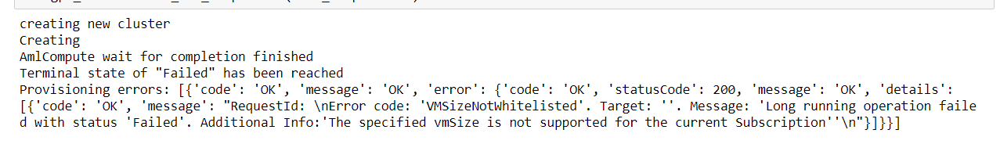

Which indicates that specified vmSize has not been whitelisted for usage on Machine Learning Services and a request to do so should be filled.

The successful creation of the compute target would have an output like the following:

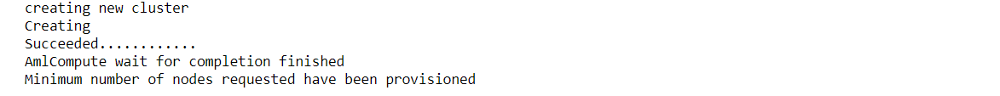
&nbsp;  
#### RAPIDS script uploading and viewing
The next step copies the RAPIDS script process_data.py, which is a slightly modified implementation of the [RAPIDS E2E example](https://github.com/rapidsai/notebooks/blob/master/mortgage/E2E.ipynb), into a script processing folder and it presents its contents to the user. (The script is discussed in the next section in detail). 
If the user wants to use a different RAPIDS script, the references to the  process_data.py script have to be changed

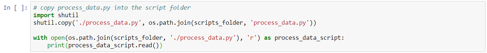
&nbsp;  
#### Data Uploading
The RAPIDS script loads and extracts features from the Fannie Mae’s Mortgage Dataset to train an XGBoost prediction model. The script uses two years of data

The next few steps download and decompress the data and is made available to the  script as an [Azure Machine Learning Datastore](https://docs.microsoft.com/en-us/azure/machine-learning/service/how-to-access-data).

&nbsp;  
The following functions are used to download and decompress the input data

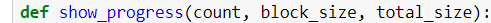

&nbsp;  
The next step uses those functions to download locally file: 
http://rapidsai-data.s3-website.us-east-2.amazonaws.com/notebook-mortgage-data/mortgage_2000-2001.tgz'
And to decompress it, into local folder path = .\mortgage_2000-2001
The step takes several minutes, the intermediate outputs provide progress indicators.

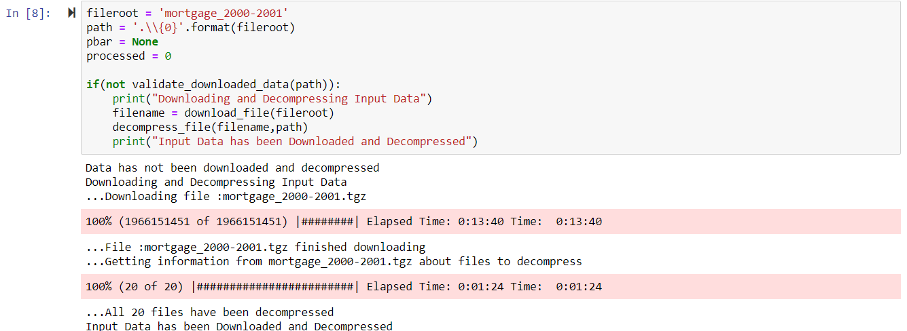

&nbsp;  
The decompressed data should have the following structure:
* .\mortgage_2000-2001\acq\Acquisition_<year>Q<num>.txt 
* .\mortgage_2000-2001\perf\Performance_<year>Q<num>.txt 
* .\mortgage_2000-2001\names.csv

The data is divided in partitions that roughly correspond to yearly quarters. RAPIDS includes support for multi-node, multi-GPU deployments, enabling scaling up and out on much larger dataset sizes. The user will be able to verify that the number of partitions that the script is able to process increases with the number of GPUs used. The RAPIDS script is implemented for single-machine scenarios. An example supporting multiple nodes will be published later. 

&nbsp;  
The next step upload the data into the [Azure Machine Learning Datastore](https://docs.microsoft.com/en-us/azure/machine-learning/service/how-to-access-data) under reference fileroot = mortgage_2000-2001

The step takes several minutes to load the data, the output provides a progress indicator.

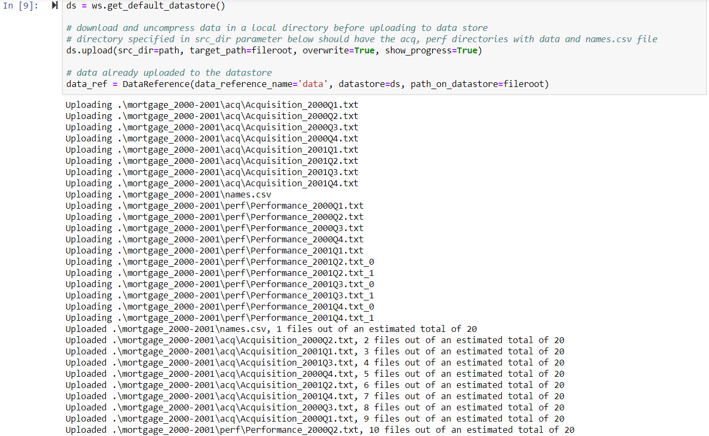

Once the data has been loaded into the Azure Machine LEarning Data Store, in subsequent run, the user can comment out the ds.upload line and just make reference to the mortgage_2000-2001</blog> data store reference  

&nbsp;  
#### Setting up required libraries and environment to run RAPIDS code
There are two options to setup the environment to run RAPIDS code. The following steps shows how to ues a prebuilt conda environment. A recommended alternative is to specify a base Docker image and package dependencies. You can find sample code for that in the notebook.

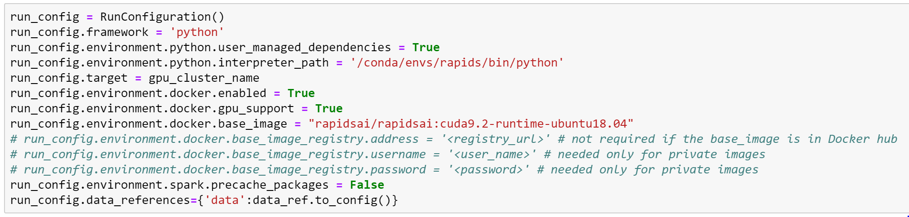

&nbsp;  
#### Wrapper function to submit the RAPIDS script as an Azure Machine Learning experiment

The next step consists of the definition of a wrapper function to be used when the user attempts to run the RAPIDS script with different arguments. It takes as arguments: *cpu\_training*;  a flag that indicates if the run is meant to be processed with CPU-only, *gpu\_count*; the number of GPUs to be used if they are meant to be used and part_count: the number of data partitions to be used

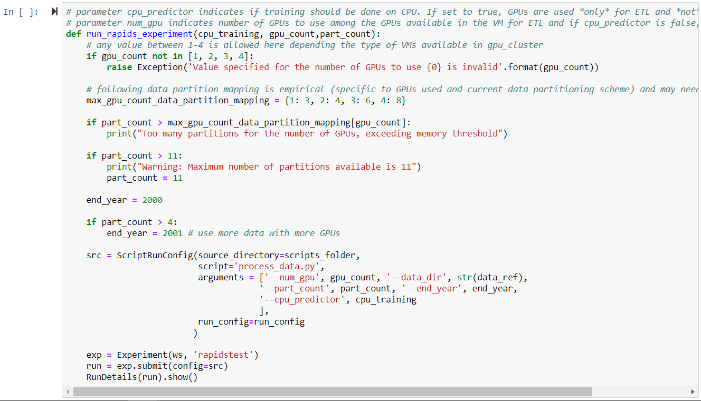

&nbsp;  
The core of the function resides in configuring the run by the instantiation of a ScriptRunConfig object, which defines the source_directory for the script to be executed, the name of the script and the arguments to be passed to the script.
In addition to the wrapper function arguments, two other arguments are passed: *data\_dir*, the directory where the data is stored and *end_year* is the largest year to use partition from.

As mentioned earlier the size of the data that can be processed increases with the number of gpus, in the function, dictionary *max\_gpu\_count\_data\_partition_mapping* maps the maximum number of partitions that we empirically found that the system can handle given the number of GPUs used. The function throws a warning when the number of partitions for a given number of gpus exceeds the maximum but the script is still executed, however the user should expect an error as an out of memory situation would be encountered
If the user wants to use a different RAPIDS script, the reference to the process_data.py script has to be changed

&nbsp;  
#### Submitting Experiments
We are ready to submit experiments: launching the RAPIDS script with different sets of parameters.

&nbsp;  
The following couple of steps submit experiments under different conditions. 

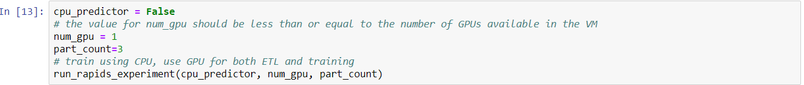

&nbsp;  
The user can change variable num\_gpu between one and the number of GPUs supported by the chosen vmSize. Variable part\_count can take any value between 1 and 11, but if it exceeds the maximum for num_gpu, the run would result in an error

&nbsp;  
If the experiment is successfully submitted, it would be placed on a queue for processing, its status would appeared as Queued and an output like the following would appear 

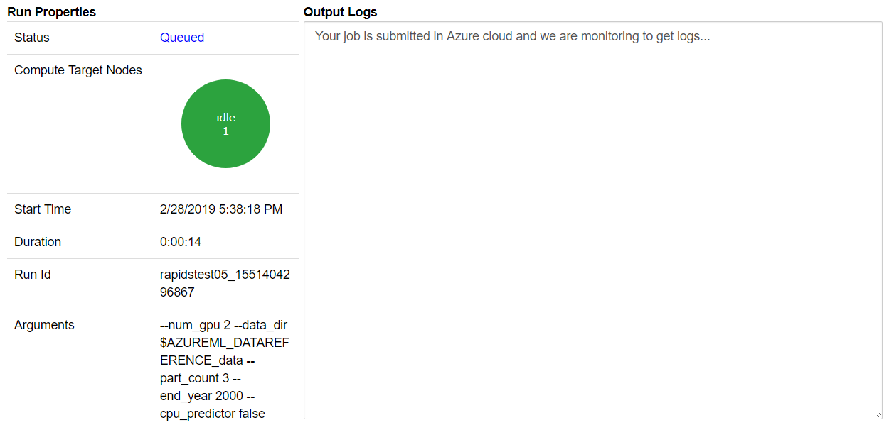

&nbsp;  
When the experiment starts running, its status would appeared as Running and the output would change to something like this:

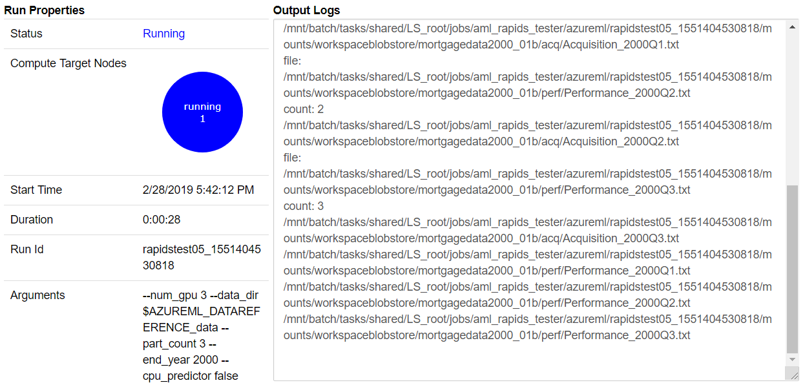

&nbsp;  
#### Reproducing the performance gains plot results on the Blog Post
When the run has finished successfully, its status would appeared as Completed and the output would change to something like this:

&nbsp; 
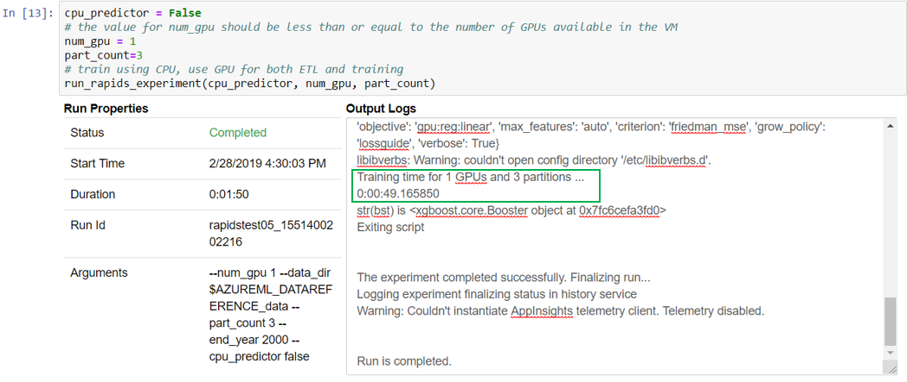

Which is the output for an experiment run with three partitions and one GPU, notice that the reported processing time is 49.16 seconds just as depicted on the performance gains plot on the blog post

&nbsp;  

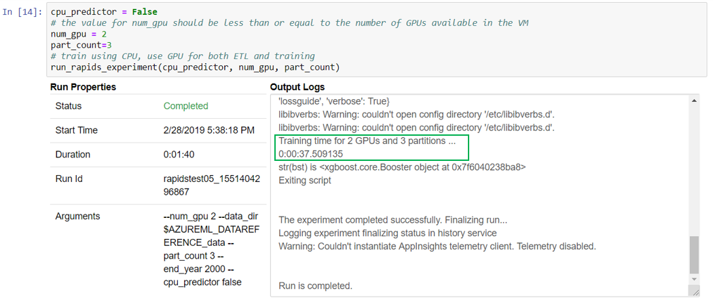

This output corresponds to a run with three partitions and two GPUs, notice that the reported processing time is 37.50 seconds just as depicted on the performance gains plot on the blog post

&nbsp;  
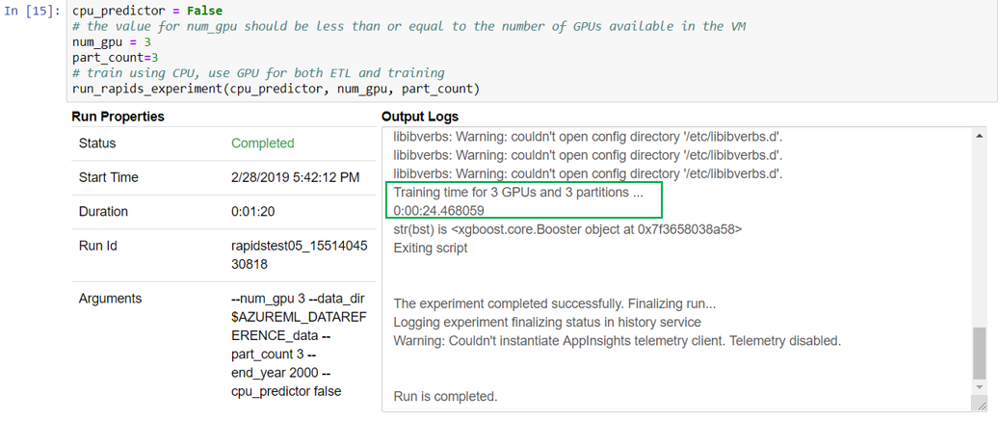

This output corresponds to an experiment run with three partitions and three GPUs, notice that the reported processing time is 24.40 seconds just as depicted on the performance gains plot on the blog post

&nbsp;  
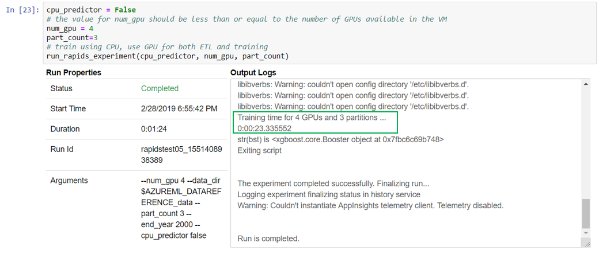

This output corresponds to an experiment run with three partitions and four GPUs, notice that the reported processing time is 23.33 seconds just as depicted on the performance gains plot on the blogpost

&nbsp;  
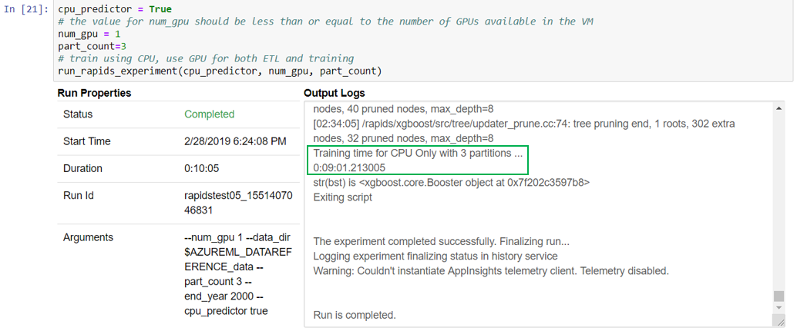

This output corresponds to an experiment run with three partitions and using only CPU, notice that the reported processing time is 9 minutes and 1.21 seconds or 541.21 second just as depicted on the performance gains plot on the blog post

&nbsp;  
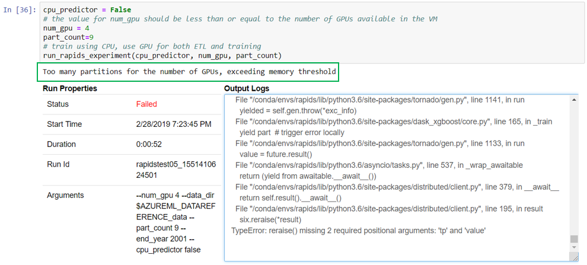

This output corresponds to an experiment run with nine partitions and four GPUs, notice that the notebook throws a warning signaling that the number of partitions exceed the maximum that the system can handle with those many GPUs and the run ends up failing, hence having and status of Failed. 

&nbsp;  
##### Freeing Resources
In the last step the notebook deletes the compute target. (This step is optional especially if the min_nodes in the cluster is set to 0 with which the cluster will scale down to 0 nodes when there is no usage.)

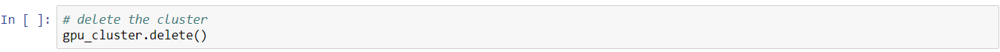

&nbsp;  
### RAPIDS Script
The Master Notebook runs experiments by launching a RAPIDS script with different sets of parameters. In this section, the RAPIDS script, process_data.py in the material, is analyzed

The script first imports all the necessary libraries and parses the arguments passed by the Master Notebook.

The all internal functions to be used by the script are defined.

&nbsp;  
#### Wrapper Auxiliary Functions:
The below functions are wrappers for a configuration module for librmm, the RAPIDS Memory Manager python interface:

&nbsp;  
A couple of other functions are wrappers for the submission of jobs to the DASK client:

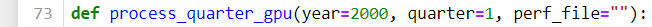

&nbsp;  
#### Data Loading Functions:
The data is loaded through the use of the following three functions 

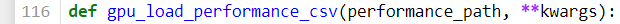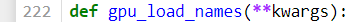

All three functions use library function cudf.read_csv(), cuDF version for the well known counterpart on Pandas.

&nbsp;  
#### Data Transformation and Feature Extraction Functions:
The raw data is transformed and processed to extract features by joining, slicing, grouping, aggregating, factoring, etc, the original dataframes just as is done with Pandas. The following functions in the script are used for that purpose:
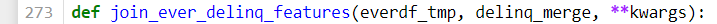

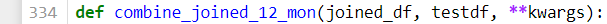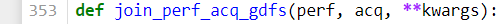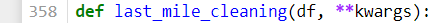

&nbsp;  
#### Main() Function
The previous functions are used in the Main function to accomplish several steps: Set up the Dask client, do all ETL operations, set up and train an XGBoost model, the function also assigns which data needs to be processed by each Dask client

&nbsp;  
##### Setting Up DASK client:
The following lines:

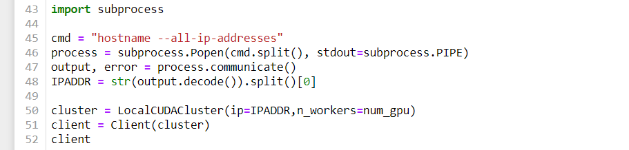

&nbsp;  
Initialize and set up a DASK client with a number of workers corresponding to the number of GPUs to be used on the run. A successful execution of the set up will result on the following output:

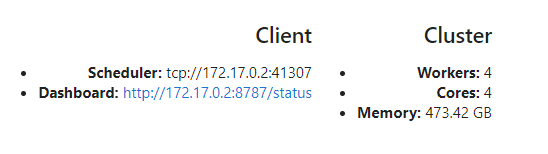

##### All ETL functions are used on single calls to process\_quarter_gpu, one per data partition

&nbsp;  
##### Concentrating the data assigned to each DASK worker
The partitions assigned to each worker are concatenated and set up for training.

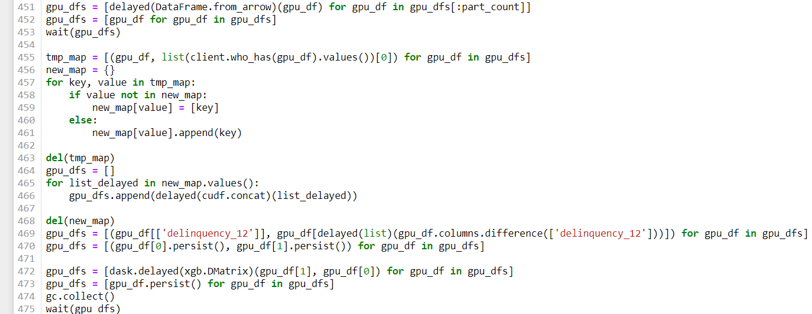

&nbsp;  
##### Setting Training Parameters
The parameters used for the training of a gradient boosted decision tree model are set up in the following code block:
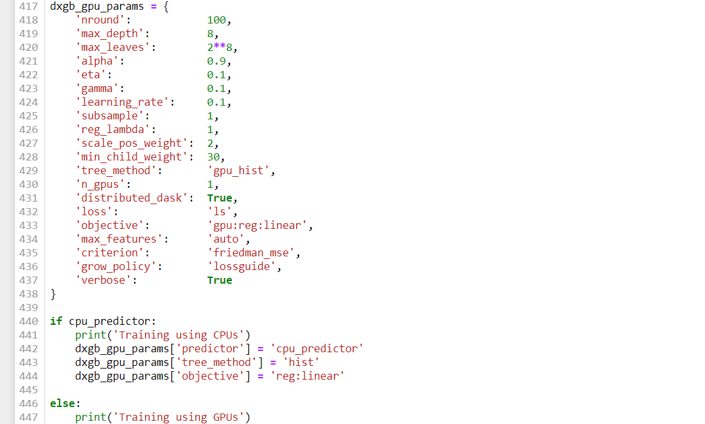

Notice how the parameters are modified when using the CPU-only mode.

&nbsp;  
##### Launching the training of a gradient boosted decision tree model using XGBoost.

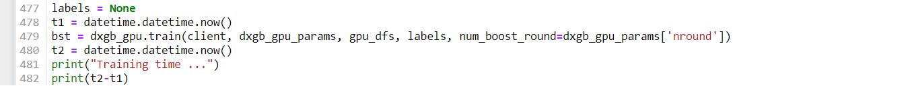

The outputs of the script can be observed in the master notebook as the script is executed

