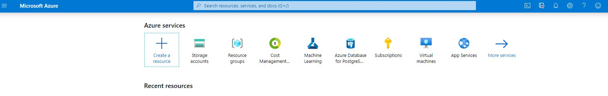
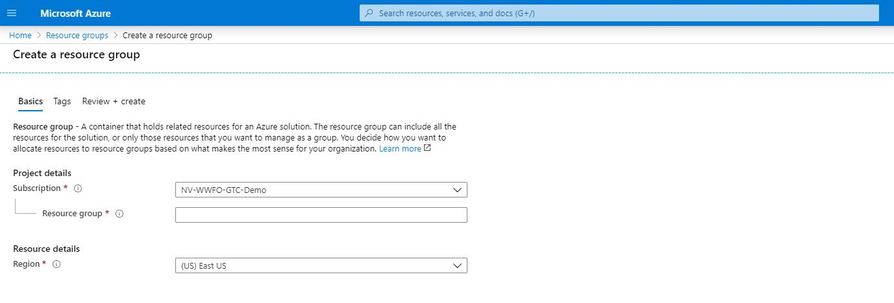
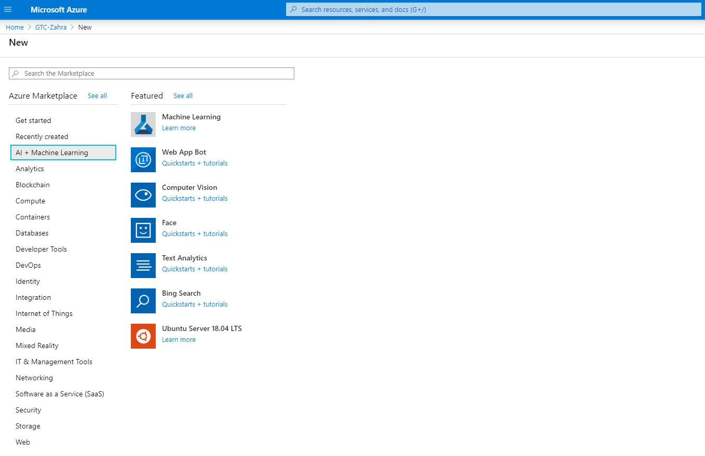
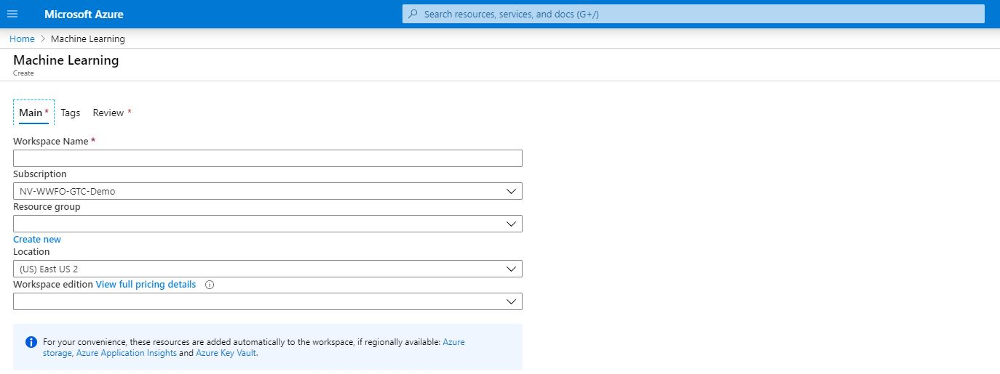
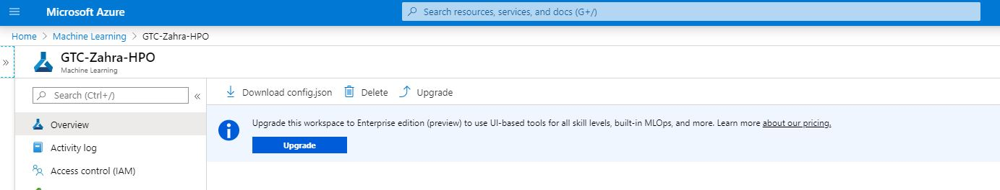

# RAPIDS Hyperparameter Optimization on AzureML

This example will walk you through how to launch RAPIDS-accelerated hyperparameter optimization jobs on Microsoft Azure ML. Azure ML will train and evaluate models with many different variations of key parameters in order to find the combination that yields the highest accuracy. You'll start by launching a Jupyter notebook locally, which will launch all of the jobs and walk you through the process in more detail.

## Create an Azure Machine Learning Service Workspace

### Resource Groups and Workspaces

An [Azure Machine Learning service workspace](https://docs.microsoft.com/en-us/azure/machine-learning/concept-workspace) will manage experiments and coordinate storage, databases and computing resources for machine learning applications. 

1. First create an [Azure subscription](https://azure.microsoft.com/en-us/free/) or access existing information from the [Azure portal](https://portal.azure.com/).

2. Next you will need to access a [Resource group](https://docs.microsoft.com/en-us/azure/azure-resource-manager/management/overview#resource-groups) or create a new one in Azure portal: 

- Sign in to the Azure portal and navigate to Resource groups page by clicking on **Resource groups** in the portal:

- Select one of the available Resource groups or create a new one by clicking on the **Add** button:

- You can also select **+ Create a resource** in the upper-left corner of Azure portal and search for Resource group

Select a a *Subscription* with GPU resources, enter a name for the *Resource group* and select a *Region* with GPU resources. Check these pages for the [List](https://azure.microsoft.com/en-us/global-infrastructure/services/?products=machine-learning-service) of supported regions and [information](https://docs.microsoft.com/en-us/azure/virtual-machines/sizes-gpu) on GPU optimized VM sizes. Pick a region that is closest to your location or contains your data. 

 3. Next we will create a Machine Learning service workspace: navigate to your Resource groups page and click on the **Add** button, this will take you to the [Azure Marketplace](https://azuremarketplace.microsoft.com/). Use the search bar to find **Machine Learning** or select **AI + Machine Learning** category on the left:  

- Click on *Machine Learning* and this will direct you to the page below:

- Enter a unique *Workspace Name* that indentifies your workspace, select your Azure *Subscription*, use an existing *Resource group* in your subscription and select a *Location* with adequate GPU quota.

After entering the information, select **Review + Create**. The deployment success message will appear and and you can view the new workspace by clicking on **Go to resource**. 

4. After creating the workspace, download the **config.json** file that includes information about workspace configuration. 

This file will be used with [Azure Machine Learning SDK for Python](https://docs.microsoft.com/en-us/python/api/overview/azure/ml/?view=azure-ml-py) in the notebook example to load the workspace and contains a dictionary list with key-values for:

* Workspace name
* Azure region
* Subscription id
* Resource group

## Set up environment on local computer

Install the [Azure Machine Learning Python SDK](https://docs.microsoft.com/en-us/python/api/overview/azure/ml/install?view=azure-ml-py) (if you are running in your own environment. SDK is already installed in [Azure Notebooks](https://notebooks.azure.com/) or other Microsoft managed environments), this link includes additional instructions to [setup environment](https://docs.microsoft.com/en-us/azure/machine-learning/how-to-configure-environment#local) on your local computer. 

After setting up a conda environment, clone the [clould-ml-examples repository](https://github.com/rapidsai/cloud-ml-examples.git) by running the following command in a `local_directory`: 

git clone https://github.com/rapidsai/cloud-ml-examples.git 

### Notebooks and Scripts

Navigate to the azure/notebooks subdirectory. This will include hyperparameter optimizaiton notebooks: HPO-RAPIDS.ipynb and HPO-SKLearn.ipynb. Copy the **config.json** file (that you downloaded after creating a ML workspace) in the directory that contains these notebooks (azure/notebooks). You will load the information from this file in the `Initialize workspace` step of the notebook.

Activate the conda environment, where the Azure ML SDK was installed and launch the Jupyter Notebook server with the following command:

jupyter notebook

Open your web browser, navigate to http://localhost:8888/ and access `HPO-RAPIDS.ipynb` from your local machine. Follow the steps in the notebook for hyperparameter tuning with RAPIDS on GPUs.