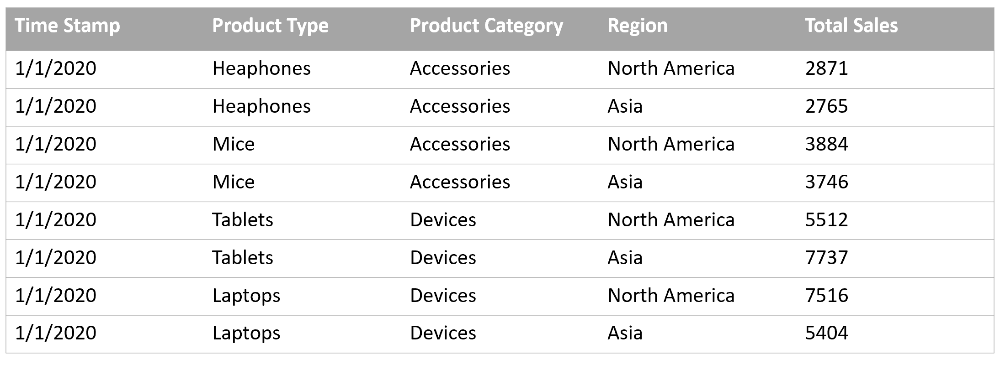
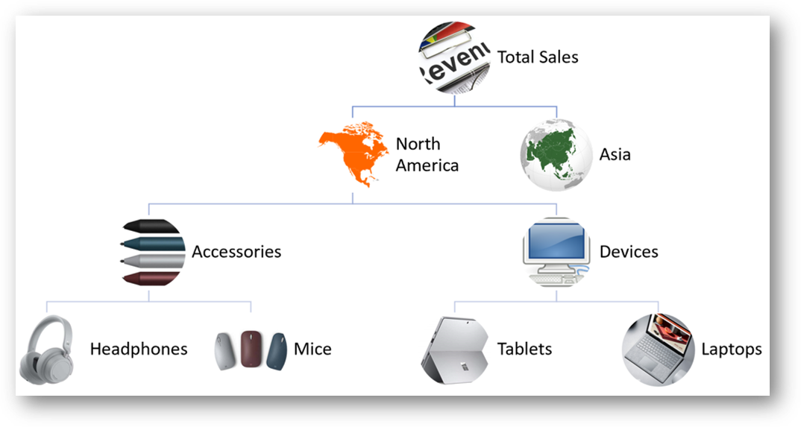
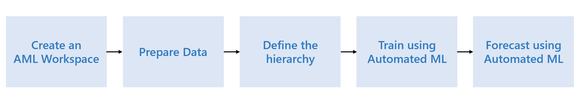

## Microsoft Solution Accelerator: Hierachical Time Series Forecasting

In most applications, customers have a need to understand their forecasts at a macro and micro level of the business. Whether that be predicting sales of products at different geographic locations, or understanding the expected workforce demand for different organizations at a company, the ability to train a machine learning model to intelligently forecast on hierarchy data is essential.

This business pattern is common across a wide variety of industries and applicable to many real world use cases. Below are some examples of where the hierarchical time series pattern is useful.

| Industry       | Scenario                                |
|----------------|--------------------------------------------|
| *Restaurant Chain* | Building demand forecasting models across thousands of restaurants and several countries. |
| *Retail Organization* | Building workforce optimization models for thousands of stores. |
| *Retail Organization*| Price optimization models for hundreds of thousands of products available. |

### Technical Summary

A hierarchical time series is a structure in which each of the unique series are arranged into a hierarchy based on dimensions such as geography, or product type. The table below shows an example of data whose unique attributes form a hierarchy. Our hierarchy is defined by the `product type` such as headphones or tablets, the `product category` which splits product types into accessories and devices, and the `region` the products are sold in. The table below demonstrates the first input of each unique series in the hierarchy.

To further visualize this, the leaf levels of the hierarchy contain all the time series with unique combinations of attribute values. Each higher level in the hierarchy will consider one less dimension for defining the time series and will aggregate each set of `child nodes` from the lower level into a `parent node`.

> **Note:** If no unique root level exists in the data, Automated Machine Learning will create a node `automl_top_level` for users to train or forecasts totals.

## Prerequisites

To use this solution accelerator, all you need is access to an [Azure subscription](https://azure.microsoft.com/free/) and an [Azure Machine Learning Workspace](https://docs.microsoft.com/azure/machine-learning/how-to-manage-workspace) that you'll create below.

A basic understanding of Azure Machine Learning and hierarchical time series concepts will be helpful for understanding the solution. The following resources can help introduce you to these concepts:

1. [Azure Machine Learning Overview](https://azure.microsoft.com/services/machine-learning/)
2. [Azure Machine Learning Tutorials](https://docs.microsoft.com/azure/machine-learning/tutorial-1st-experiment-sdk-setup)
3. [Azure Machine Learning Sample Notebooks on Github](https://github.com/Azure/azureml-examples/)
4. [Forecasting: Principles and Practice, Hierarchical time series](https://otexts.com/fpp2/hts.html)

## Getting started

### 1. Set up the Compute Instance
Please create a [Compute Instance](https://docs.microsoft.com/en-us/azure/machine-learning/concept-compute-instance#create) and clone the git repo to your workspace.

### 2. Run the Notebook

Once your environment is set up, go to JupyterLab and run the notebook auto-ml-hierarchical-timeseries.ipynb on Compute Instance you created. It would run through the steps outlined sequentially. By the end, you'll know how to train, score, and make predictions using the hierarchical time series model pattern on Azure Machine Learning.

| Notebook       | Description                                |
|----------------|--------------------------------------------|
| `auto-ml-forecasting-hierarchical-timeseries.ipynb`|Creates a pipeline to train machine learning models for the defined hierarchy and forecast at the desired hierarchy level using Automated ML. |

## Key Concepts

### Automated Machine Learning

[Automated Machine Learning](https://docs.microsoft.com/azure/machine-learning/concept-automated-ml) also referred to as automated ML or AutoML, is the process of automating the time consuming, iterative tasks of machine learning model development. It allows data scientists, analysts, and developers to build ML models with high scale, efficiency, and productivity all while sustaining model quality.

### Pipelines

[Pipelines](https://docs.microsoft.com/azure/machine-learning/concept-ml-pipelines) allow you to create workflows in your machine learning projects. These workflows have a number of benefits including speed, simplicity, repeatability, and modularity.

### ParallelRunStep

[ParallelRunStep](https://docs.microsoft.com/en-us/python/api/azureml-pipeline-steps/azureml.pipeline.steps.parallel_run_step.parallelrunstep?view=azure-ml-py) enables the parallel training of models and is commonly used for batch inferencing. This [document](https://docs.microsoft.com/azure/machine-learning/how-to-use-parallel-run-step) walks through some of the key concepts around ParallelRunStep.

### Other Concepts

In additional to ParallelRunStep, Pipelines and Automated Machine Learning, you'll also be working with the following concepts including [workspace](https://docs.microsoft.com/azure/machine-learning/concept-workspace), [datasets](https://docs.microsoft.com/azure/machine-learning/concept-data#datasets), [compute targets](https://docs.microsoft.com/azure/machine-learning/concept-compute-target#train), [python script steps](https://docs.microsoft.com/python/api/azureml-pipeline-steps/azureml.pipeline.steps.python_script_step.pythonscriptstep?view=azure-ml-py), and [Azure Open Datasets](https://azure.microsoft.com/services/open-datasets/).

## Contributing

This project welcomes contributions and suggestions. To learn more visit the [contributing](CONTRIBUTING.md) section.

Most contributions require you to agree to a Contributor License Agreement (CLA)
declaring that you have the right to, and actually do, grant us
the rights to use your contribution. For details, visit https://cla.opensource.microsoft.com.

When you submit a pull request, a CLA bot will automatically determine whether you need to provide
a CLA and decorate the PR appropriately (e.g., status check, comment). Simply follow the instructions
provided by the bot. You will only need to do this once across all repos using our CLA.

This project has adopted the [Microsoft Open Source Code of Conduct](https://opensource.microsoft.com/codeofconduct/).
For more information see the [Code of Conduct FAQ](https://opensource.microsoft.com/codeofconduct/faq/) or
contact [opencode@microsoft.com](mailto:opencode@microsoft.com) with any additional questions or comments.
