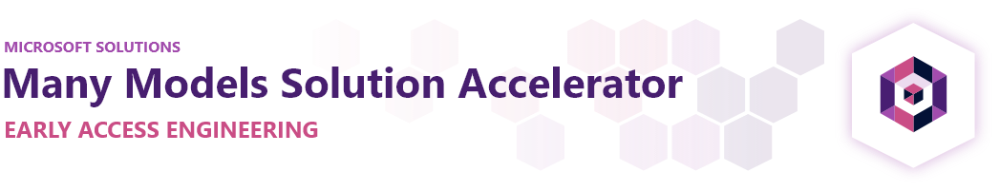
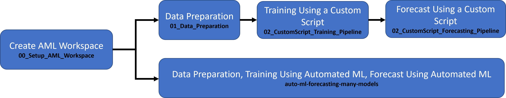
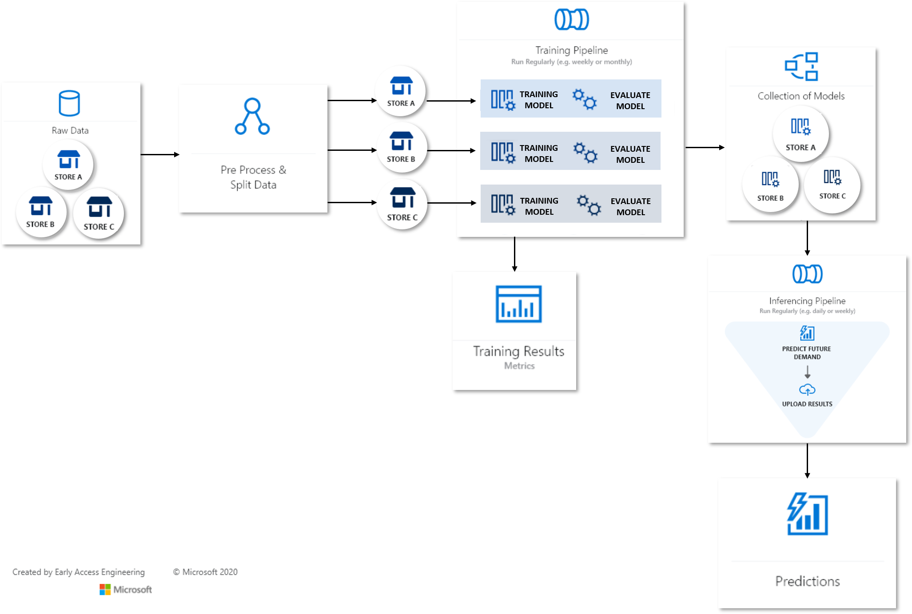

# Many Models Solution Accelerator

<!-- 
Guidelines on README format: https://review.docs.microsoft.com/help/onboard/admin/samples/concepts/readme-template?branch=master

Guidance on onboarding samples to docs.microsoft.com/samples: https://review.docs.microsoft.com/help/onboard/admin/samples/process/onboarding?branch=master

Taxonomies for products and languages: https://review.docs.microsoft.com/new-hope/information-architecture/metadata/taxonomies?branch=master
-->

In the real world, many problems can be too complex to be solved by a single machine learning model. Whether that be predicting sales for each individual store, building a predictive maintanence model for hundreds of oil wells, or tailoring an experience to individual users, building a model for each instance can lead to improved results on many machine learning problems.

This Pattern is very common across a wide variety of industries and applicable to many real world use cases. Below are some examples we have seen where this pattern is being used.

- Energy and utility companies building predictive maintenance models for thousands of oil wells, hundreds of wind turbines or hundreds of smart meters

- Retail organizations building workforce optimization models for thousands of stores, campaign promotion propensity models, Price optimization models for hundreds of thousands of products they sell

- Restaurant chains building demand forecasting models across thousands of restaurants  

- Banks and financial institutes building models for cash replenishment for ATM Machine and for several ATMs or building personalized models for individuals

- Enterprises building revenue forecasting models at each division level

- Document management companies building text analytics and legal document search models per each state

Azure Machine Learning (AML) makes it easy to train, operate, and manage hundreds or even thousands of models. This repo will walk you through the end to end process of creating a many models solution from training to scoring to monitoring.

## Prerequisites

To use this solution accelerator, all you need is access to an [Azure subscription](https://azure.microsoft.com/free/) and an [Azure Machine Learning Workspace](https://docs.microsoft.com/azure/machine-learning/how-to-manage-workspace) that you'll create below.

While it's not required, a basic understanding of Azure Machine Learning will be helpful for understanding the solution. The following resources can help introduce you to AML:

1. [Azure Machine Learning Overview](https://azure.microsoft.com/services/machine-learning/)
2. [Azure Machine Learning Tutorials](https://docs.microsoft.com/azure/machine-learning/tutorial-1st-experiment-sdk-setup)
3. [Azure Machine Learning Sample Notebooks on Github](https://github.com/Azure/azureml-examples)

## Getting started

### 1. Deploy Resources

Start by deploying the resources to Azure. The button below will deploy Azure Machine Learning and its related resources:

### 2. Configure Development Environment

Next you'll need to configure your [development environment](https://docs.microsoft.com/azure/machine-learning/how-to-configure-environment) for Azure Machine Learning. We recommend using a [Compute Instance](https://docs.microsoft.com/azure/machine-learning/how-to-configure-environment#compute-instance) as it's the fastest way to get up and running.

### 3. Run Notebooks

Once your development environment is set up, run through the Jupyter Notebooks sequentially following the steps outlined. By the end, you'll know how to train, score, and make predictions using the many models pattern on Azure Machine Learning.

## Contents

In this repo, you'll train and score a forecasting model for each orange juice brand and for each store at a (simulated) grocery chain. By the end, you'll have forecasted sales by using up to 11,973 models to predict sales for the next few weeks.

The data used in this sample is simulated based on the [Dominick's Orange Juice Dataset](http://www.cs.unitn.it/~taufer/QMMA/L10-OJ-Data.html#(1)), sales data from a Chicago area grocery store.

### Using Automated ML to train the models:

The [`auto-ml-forecasting-many-models.ipynb`](./auto-ml-forecasting-many-models.ipynb) noteboook is a guided solution accelerator that demonstrates steps from data preparation, to model training, and forecasting on train models as well as operationalizing the solution.

## How-to-videos

Watch these how-to-videos for a step by step walk-through of the many model solution accelerator to learn how to setup your models using Automated ML.

### Automated ML

## Key concepts

### ParallelRunStep

[ParallelRunStep](https://docs.microsoft.com/en-us/python/api/azureml-pipeline-steps/azureml.pipeline.steps.parallel_run_step.parallelrunstep?view=azure-ml-py) enables the parallel training of models and is commonly used for batch inferencing. This [document](https://docs.microsoft.com/azure/machine-learning/how-to-use-parallel-run-step) walks through some of the key concepts around ParallelRunStep.

### Pipelines

[Pipelines](https://docs.microsoft.com/azure/machine-learning/concept-ml-pipelines) allow you to create workflows in your machine learning projects. These workflows have a number of benefits including speed, simplicity, repeatability, and modularity.

### Automated Machine Learning

[Automated Machine Learning](https://docs.microsoft.com/azure/machine-learning/concept-automated-ml) also referred to as automated ML or AutoML, is the process of automating the time consuming, iterative tasks of machine learning model development. It allows data scientists, analysts, and developers to build ML models with high scale, efficiency, and productivity all while sustaining model quality.

### Other Concepts

In additional to ParallelRunStep, Pipelines and Automated Machine Learning, you'll also be working with the following concepts including [workspace](https://docs.microsoft.com/azure/machine-learning/concept-workspace), [datasets](https://docs.microsoft.com/azure/machine-learning/concept-data#datasets), [compute targets](https://docs.microsoft.com/azure/machine-learning/concept-compute-target#train), [python script steps](https://docs.microsoft.com/python/api/azureml-pipeline-steps/azureml.pipeline.steps.python_script_step.pythonscriptstep?view=azure-ml-py), and [Azure Open Datasets](https://azure.microsoft.com/services/open-datasets/).

## Contributing

This project welcomes contributions and suggestions. To learn more visit the [contributing](../../../CONTRIBUTING.md) section.

Most contributions require you to agree to a Contributor License Agreement (CLA)
declaring that you have the right to, and actually do, grant us
the rights to use your contribution. For details, visit https://cla.opensource.microsoft.com.

When you submit a pull request, a CLA bot will automatically determine whether you need to provide
a CLA and decorate the PR appropriately (e.g., status check, comment). Simply follow the instructions
provided by the bot. You will only need to do this once across all repos using our CLA.

This project has adopted the [Microsoft Open Source Code of Conduct](https://opensource.microsoft.com/codeofconduct/).
For more information see the [Code of Conduct FAQ](https://opensource.microsoft.com/codeofconduct/faq/) or
contact [opencode@microsoft.com](mailto:opencode@microsoft.com) with any additional questions or comments.
