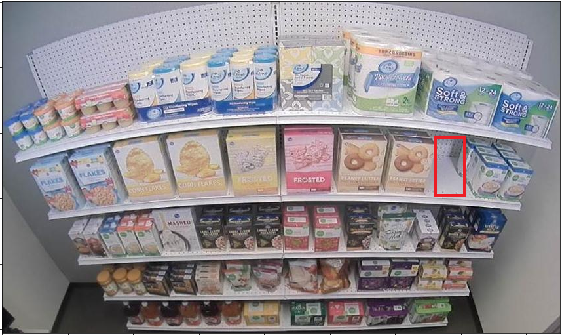

# Fine-tuning a VGG-SSD Object Detector and Deploying it on FPGA in the Cloud

## Overview

The `notebooks` subfolder contains two notebooks that demonstrate fine-tuning and deploying an object detector. 

Fine-tuning is covered in [Finetune VGG SSD](notebooks/Finetune%20VGG%20SSD.ipynb) notebook. It shows the end-to-end process of creating a new object detector based on the [VGG SSD architecture](https://www.cs.unc.edu/~wliu/papers/ssd.pdf) trained on VOC2007 + VOC2012 trainval. 

The [Deploy Accelerated](notebooks/Deploy%20Accelerated.ipynb) notebook shows how to use AzureML for deploying the model obtained by fine-tuning the VGG SSD detector on the FPGA cloud. Refer to this [README](../README.md) for instructions on how to install AzureML and get access to FPGA-enabled machines in Azure.

## Preparation

We recommend the following configuration before getting started with training:

* Windows or Linux OS
* CUDA 10.0 + cuDNN 7.4
* [Anaconda Python](https://www.anaconda.com/distribution/)
* Create a conda [virtual environment](https://docs.conda.io/projects/conda/en/latest/user-guide/tasks/manage-environments.html). E.g.:

```sh
$ conda create -n myenv python=3.6 anaconda
$ conda activate myenv
```
* Install Tensorflow 1.10+ with GPU support in the environment. E.g.:

```sh
pip install -U --ignore-installed tensorflow-gpu==1.13.1
```
* Install opencv-python

```sh
$ pip install opencv-python
```

* Make sure the steps from this [README](../README.md) are complete.


## Training

[Finetune VGG SSD](notebooks/Finetune%20VGG%20SSD.ipynb) demonstrates all aspects of fine-tuning VGG SSD. The model can be fine-tuned on a dataset with objects categorized into a maximum of 20 classes (21 if counting "none" or "background"), due to current FPGA deployment limitations.

### The Code

All of the modules necessary for the training process are located in the `tfssd` folder. It needs to be added to the system path prior to running training.

```python
sys.path.insert(0, os.path.abspath('tfssd'))
```

### Preparing Training/Validation Data

The detector understands data in [PASCAL VOC](https://gist.github.com/Prasad9/30900b0ef1375cc7385f4d85135fdb44) format. Tools like [labelImg](https://github.com/tzutalin/labelImg) produce data in this format. See the `examples` subfolder for a sample small dataset. In this example we train our detector to recognize gaps between products on shelves in a general store with a goal to be able to alert the store manager quickly that re-stocking is necessary.



Each image file needs to have a matching XML file. The files should be placed into `JPEGImages` and `Annotations` directories. `check_labelmatch` function in `dataset_utils` module will ensure that there are no "orphaned" images or annotations. See [sample.jpg](notebooks/sample.jpg) and [sample.xml](notebooks/sample.xml) for annotations examples (visualization shown above).

`pascalvoc_to_tfrecords.run` converts images and their annotations into TFRecord format.

**NOTE**: We expect the dataset to be split into "training" and "validation" subsets. This is done in the notebook by calling `train_test_split` from `sklearn.model`

### Fine-tuning and Evaluation

Training loop runs with periodic validation:

```python
from finetune.train import TrainVggSsd
from finetune.eval import EvalVggSsd
```

It is recommended that these objects be used as part of the Python "with" statement in a training loop:

```python
for _ in range(n_epochs):

    with TrainVggSsd(ckpt_dir, train_files, 
                     num_steps=num_train_steps, 
                     steps_to_save=steps_to_save, 
                     batch_size = batch_size,
                     learning_rate=learning_rate,
                     learning_rate_decay_steps=learning_rate_decay_steps, 
                     learning_rate_decay_value=learning_rate_decay_value) as trainer:
        trainer.train()

    with EvalVggSsd(ckpt_dir, validation_files, 
                    num_steps=num_eval_steps, 
                    num_classes=num_classes) as evaluator:
        evaluator.eval()
```

This way Tensorflow `Session` objects are handled correctly.

`TrainVggSsd` is responsible for all aspects of a training loop:

1. Downloading the initial model checkpoint for VGG SSD: graph and weights
2. Feeding data to the training loop
3. Recording progress which can be observed with `Tensorboard`:

```sh
tensorboard --logdir <checkpoint directory>
```

Evaluation outputs PASCAL VOC2012 mAP for the model. AP for each class is also recorded and can be observed in `Tensorboard` as shown above.

Here are some of the parameters accepted by `TrainVggSsd`

* `ckpt_dir` - (required) directory where checkpoints will be stored. Same for `EvalVggSsd`
* `train_files` - (required) training files (.tfrec) used as the training dataset.
* `steps_to_save` - how often a checkpoint is saved
* `batch_size` - number of images per step
* `learning_rate` - learning rate

For `EvalVggSsd`:

* `validation_files` - (required).tfrec files that form the validation dataset
* `num_steps` - number of steps in a validation run (usually same as the number of images in the validation dataset)
* `num_classes` - number of classes including background (e.g.: `2` for our simple example)

**NOTE**: We currently support `Adam` optimizer only for fine-tuning.

### Inference

```python
from finetune.inference import InferVggSsd
infer = InferVggSsd(ckpt_dir, gpu=False)
```
Inference object can run on GPU (default) and CPU. The `infer_file` function can also visualize the results:


## Deployment

 [Deploy Accelerated](notebooks/Deploy%20Accelerated.ipynb) notebook illustrates the process of deploying a finished detector in AzureML cloud.

The process consists of:

1. Saving the model for deployment with `SaverVggSsd`:

```python
from finetune.model_saver import SaverVggSsd 
```

2. Registering the model in your AzureML Workspace (created as described in this [README](../README.md))
3. Converting the model to ONNX format to make it accessible to an FPGA device.
4. Creating a Docker image from the model.
5. Deploying in the cloud. In the above example, the resulting container is deployed as a Web Service.

The above notebook demonstrates all these steps as well as has additional cells that show how to test the deployed service.